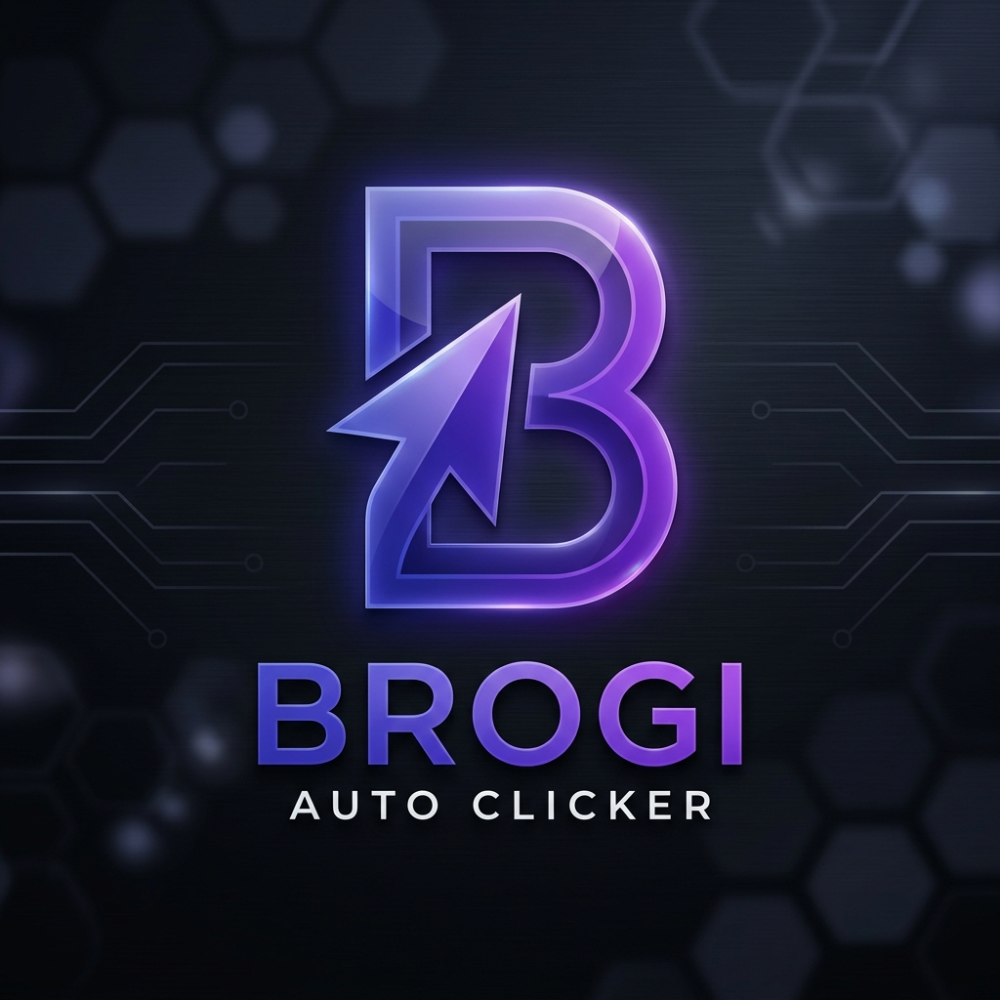

# 🖱️ Brogi Auto Clicker

**Brogi Auto Clicker** is a premium, portable, and open-source auto-clicking utility for Windows. Built with Electron, it features a modern dark glassmorphism UI and a powerful PowerShell-based clicking engine that works without needing external native dependencies like Python.



## ✨ Features

- **Flexible Clicking Modes**: Choose between following your cursor or clicking at a fixed screen coordinate.
- **Advanced Click Types**: Support for Single, Double, and Triple clicking.
- **Mouse Button Selection**: Choose between Left, Right, and Middle mouse buttons.
- **Repeat Options**: Set a specific number of clicks or let it run indefinitely.
- **Global Hotkeys**: Control the app while it's in the background. Default: `F6` to Start/Stop, `F7` to Pick Location.
- **Customizable Hotkeys**: Easily remap your control keys in the settings tab.
- **Session Persistence**: Your settings (interval, mode, location, etc.) are saved automatically and restored next time you open the app.
- **Clean UI**: A premium, ad-free, and distraction-free interface.
- **Portable**: No installation required. Just run the `.exe`.

## 🚀 Getting Started

### Prerequisites
- **Windows OS** (required for the PowerShell clicking engine)
- **Node.js** (only if building from source)

### Running the App
If you have the pre-built version:
1. Navigate to the `dist/BrogiAutoClicker-win32-x64/` folder.
2. Run `BrogiAutoClicker.exe`.

### Building from Source
1. Clone the repository.
2. Install dependencies:
   ```bash
   npm install
   ```
3. Start the app in development mode:
   ```bash
   npm start
   ```
4. Build the portable executable:
   ```bash
   npm run build
   ```

## ⌨️ Default Hotkeys

- **F6**: Start / Stop clicking.
- **F7**: Pick a fixed location (minimizes app for 3 seconds to let you position your cursor).
- **Esc**: Cancel hotkey recording in settings.

## 🛠️ Built With

- **Electron**: Main application framework.
- **PowerShell**: Used for system-level mouse events and cursor positioning (zero-dependency native integration).
- **Vanilla CSS/JS**: For the high-performance glassmorphism UI.

## 📄 License

This project is open-source and free to use.

---
*Created by Antigravity for Brogi.*
